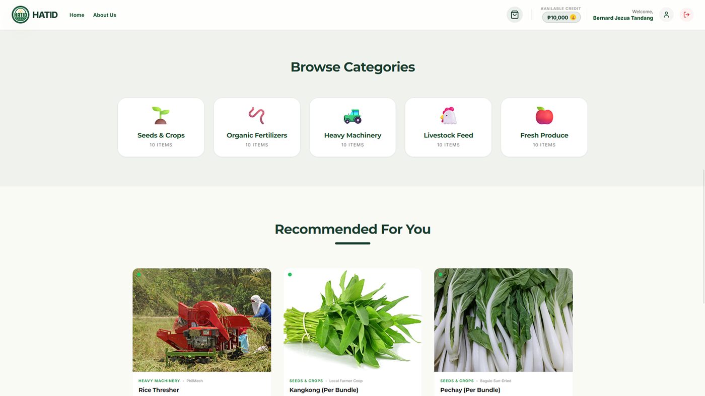
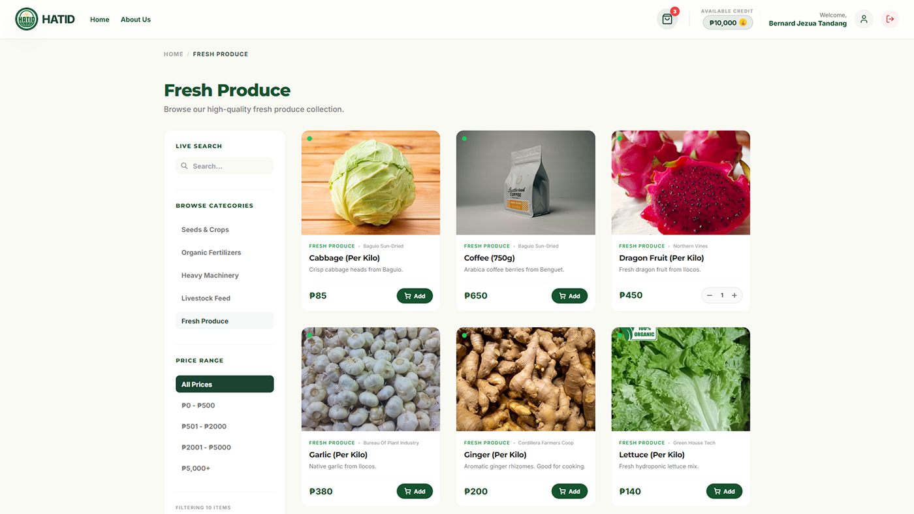
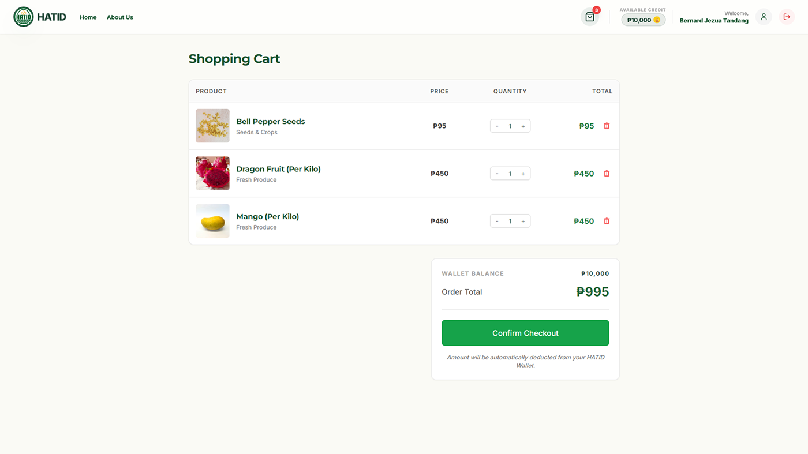
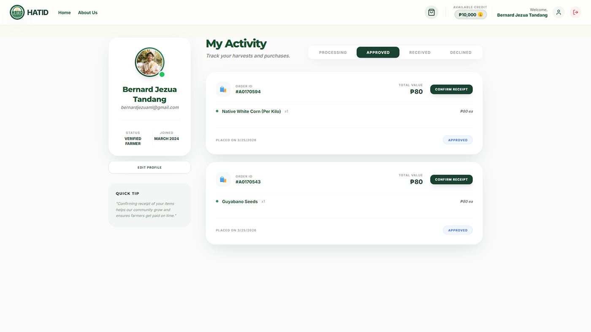
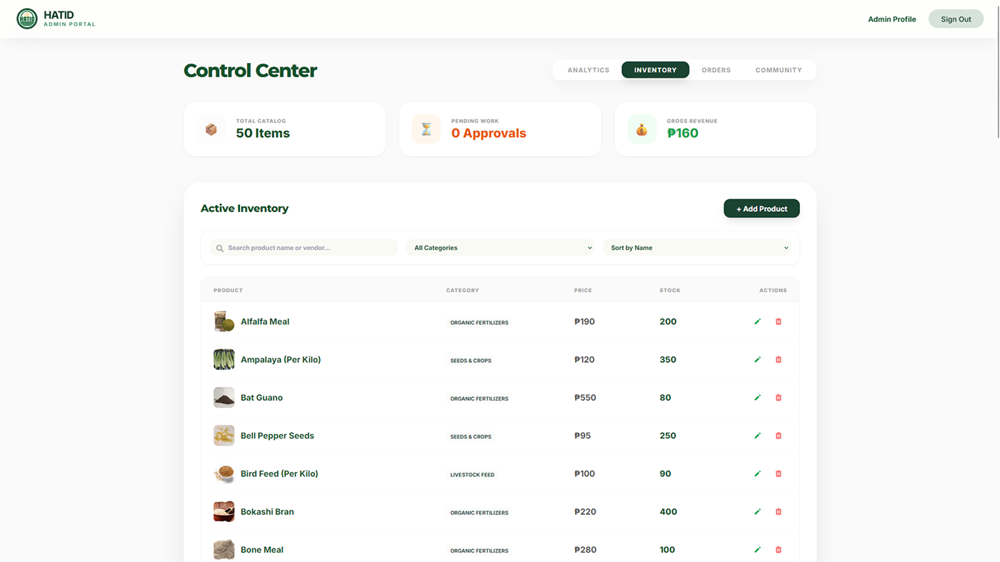
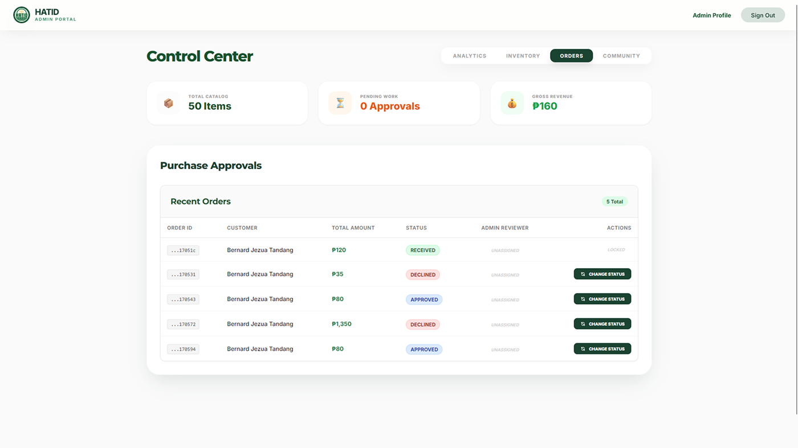

#  HATID: Agricultural E-Commerce Web Application

> **HATID** is an e-commerce solution designed for the **Department of Agriculture (DA)**. HATID (meaning "to deliver" or "to bring") was created to solve the supply chain inefficiencies that have long hindered our local farmers. It streamlines the distribution of agricultural products, connecting farmers directly to the public market through an efficient, transparent, and user-friendly digital ecosystem.

---

## 🚀 Technology Stack

| Role | Technology |
| :--- | :--- |
| **Frontend** |   |
| **Backend** |   |
| **Database** |  |
| **State Management** |  |

---

## ✨ Key Features

- **🛍️ Seamless Shopping:** Intuitive product browsing and category-based filtering.
- **🛒 Dynamic Cart:** Real-time quantity updates and persistent shopping cart.
- **👤 User Management:** Secure registration and profile tracking.
- **⚖️ Merchant Approval:** Robust admin panel for order verification and inventory control.
- **🌾 Agriculture E-Commerce:** Specifically tailored for agricultural product distribution workflows.

---

## 📷 Screenshots

### 🏠 Home Page
The landing page showcases featured agricultural products and easy navigation.


### 📂 Category Page
Filter products by specific agricultural categories for a faster shopping experience.


### 🛒 Shopping Cart
Manage selected items, adjust quantities, and review totals before checkout.


### 👤 User Profile
Track order history and manage personal account information.


### 🛡️ Approver Panel
Admin interface for reviewing and confirming customer orders.


### 📦 Inventory Management
Manage stock levels, add new products, and update pricing.


---

## 🛠️ Installation & Setup

### 1. Prerequisites
- [Node.js](https://nodejs.org/) (v14+)
- [MongoDB](https://www.mongodb.com/try/download/community)
- [pnpm](https://pnpm.io/) (Recommended)

### 2. Clone the Repository
```bash
git clone https://github.com/bernardjezua/hatid.git
cd hatid
```

### 3. Quick Start 🚀
Install all dependencies and start both client and server with a single command:

```bash
pnpm run install-all
pnpm start
```

### 4. Manual Setup
If you prefer to run them separately:

**Server:**
```bash
cd server
pnpm install
# Create a .env file and add your MONGODB_URI
pnpm run dev
```

**Client:**
```bash
cd client
pnpm install
pnpm start
```

---

## 👥 Usage Guidelines

### For Customers
1. **Explore:** Browse the vast catalog of fresh agricultural products.
2. **Account:** Create an account or sign in to save your preferences.
3. **Checkout:** Add items to your cart and submit your order for approval.

### For Admins / Merchants
1. **Verification:** Log in to the pre-assigned admin account.
2. **Management:** Use the **Approver Panel** to review pending checkouts.
3. **Inventory:** Keep the marketplace updated via the **Inventory Management** dashboard.